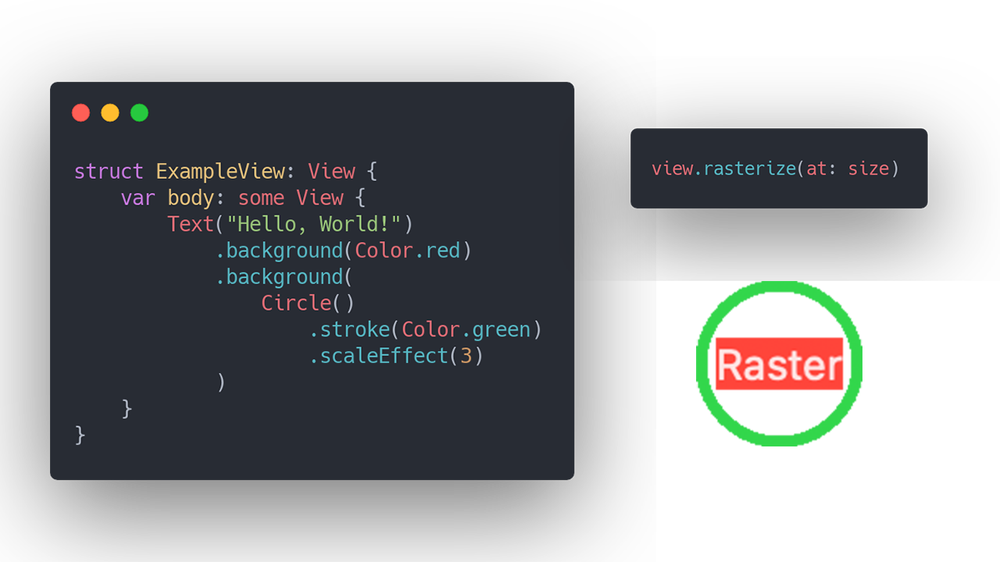

# Raster


Rasterize a SwiftUI view into an image.



# How to use

```swift
import Raster

let view = ... any SwiftUI view
let image = view.rasterize(at: size)
```

# Installation

```swift
dependencies: [
   .package(url: "https://github.com/alexito4/Raster.git", from: "0.0.1")
],
...
.target(
    dependencies: [
        "Raster"
    ],
),
```

# Author

Alejandro Martinez | http://alejandromp.com | [@alexito4](https://twitter.com/alexito4)